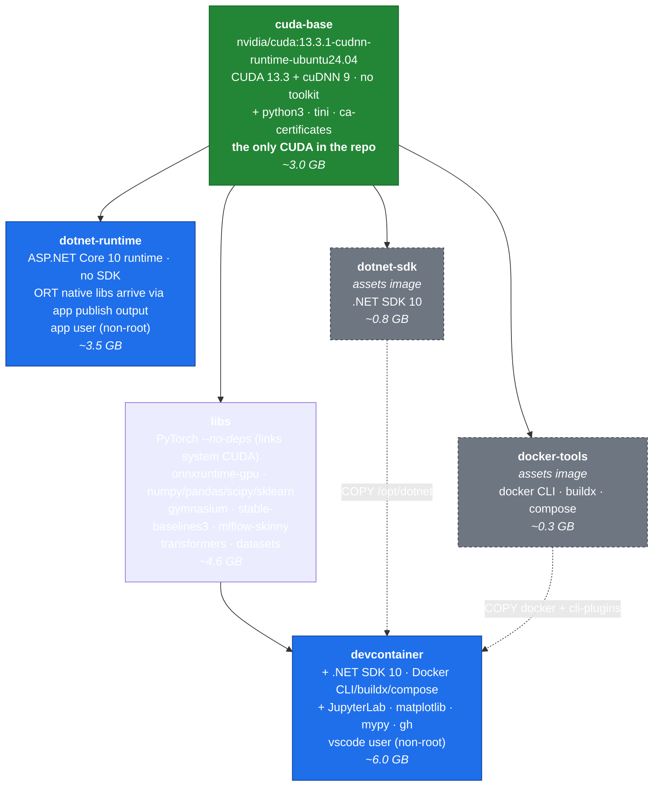

# Design: single-CUDA image stack

**Status:** approved. Core assumption verified in a prototype; implementation in
progress on branch `single-cuda-stack`.

## Intent

Build container images for ML development and for deploying C# services, where:

1. **The devcontainer is the primary deliverable.** It is where applications are
   written *and tested*, so it must contain everything the deployed app needs.
2. **Applications target ONNX Runtime** and are written in C#. They must be
   runnable and testable inside the devcontainer, not only in production.
3. **PyTorch and ONNX Runtime coexist** — PyTorch to train and export models,
   ONNX Runtime to run them. Both need CUDA, in the same image.
4. **Deployment images are lean** — ASP.NET Core runtime, no SDK, no training stack.
5. **CUDA exists exactly once**, both within any single image and across the repo.

## Problem with the current design

The repo currently ships **two complete CUDA stacks** that share no layers:

| image | provisioning | CUDA | cuDNN | payload |
|---|---|---|---|---|
| `devcontainer` | pip wheels in `site-packages/nvidia` | 13.2 | 9.24 | 3.22 GB |
| `dotnet-runtime` | system libs from `nvidia/cuda` | 13.3.1 | 9.24 | 2.88 GB |

6.1 GB of CUDA for two builds of the same thing, differing by a patch version.
They cannot share layers — different roots, different distributions (Debian vs
Ubuntu), different paths. A host running both pulls both.

This was a deliberate split made on the assumption that the deployment image
needed no PyTorch and the devcontainer needed no ONNX Runtime. That assumption
was wrong: requirement 3 above means one image needs both.

Two further problems follow from the same split:

- **`base` is not the base of everything.** It roots only the development
  branch; the deployment branch roots at `cuda-runtime`. The name promises a
  foundation the repo does not have.
- **`ml-libs` and `gpu-ml` are no longer distinct.** `gpu-ml` adds a single
  263 MB layer and has one consumer. The fan-out that justified the split
  disappeared when PyTorch moved into `ml-libs`.

## Proposed stack

One root. One CUDA. Every image shares it.



Solid arrows are `FROM`. Dashed arrows are `COPY --from` — only selected
binaries are lifted out, so the assets images' apt metadata never reaches the
final image. Sizes are estimates, not measurements.

### What this buys

- **One CUDA stack, repo-wide.** `devcontainer` and `dotnet-runtime` share the
  `cuda-base` layer. A host running both pulls ~3.0 GB of CUDA once instead of
  6.1 GB twice.
- **ONNX apps are testable where they are written.** PyTorch and ONNX Runtime
  sit in the same image, both bound to the same system CUDA.
- **`cuda-base` really is the base of everything.** No orphan branch.
- **Six targets instead of eight.** `gpu-ml` merges into `libs`; `cuda-runtime`
  merges into `cuda-base`.
- **No name stutter.** Target `libs` + prefix `goldsam/ml` publishes as
  `ghcr.io/goldsam/ml-libs`.

### What this costs

- **PyTorch installs with `--no-deps`.** Its `nvidia-*` wheels are skipped so it
  links the system CUDA. This is not the configuration PyTorch ships by default.
- **Version pinning becomes load-bearing.** torch 2.14 is built against CUDA
  13.2; the base provides 13.3.1. CUDA minor versions are normally forward
  ABI-compatible, but torch upgrades and base-image upgrades now have to be
  checked together rather than bumped independently.
- **pip must be prevented from re-adding the wheels.** torch declares
  `nvidia-*` as hard dependencies, so `/opt/torch-constraints.txt` has to pin
  them out, and every later `pip install` depends on that holding.
- **Python comes from the distro, not `python:3.x-slim`.** The base is Ubuntu,
  so the Python version is whatever that release ships, or an extra install step.

## Decisions to confirm

| # | Decision | Proposal |
|---|---|---|
| 1 | Ubuntu 24.04 or 26.04 base | **24.04** — approved |
| 2 | Python version | **3.14 via deadsnakes + venv.** Newest with both torch (cp314) and onnxruntime-gpu (cp314) wheels; 3.15 is ruled out by ORT shipping no cp315 wheel. 24.04 ships 3.12 natively, and marks it externally-managed, so a venv is required regardless |
| 3 | `onnxruntime-gpu` Python package | Install **without** its `cuda`/`cudnn` extras so it uses system CUDA |
| 4 | Keep `triton` | **Yes** — approved |
| 5 | Keep `nccl` / `cusparselt` / `nvshmem` | **Yes** — approved. cuSPARSELt and NVSHMEM are required for torch to load at all (see Verification) |
| 6 | `azure-ml` | Stays disabled |

## Verification

The design rests on PyTorch linking the system CUDA instead of its own wheels.
This was prototyped on `nvidia/cuda:13.3.1-cudnn-runtime-ubuntu24.04` with
Python 3.14 (deadsnakes) and `torch --no-deps`.

**Result: it works, after supplying three libraries the base does not carry.**

The ABI concern was unfounded — torch built for CUDA 13.2 resolves cleanly
against the base's CUDA 13.3.1:

```
libcudart.so.13   => /usr/local/cuda/lib64/libcudart.so.13
libcublas.so.13   => /usr/local/cuda/lib64/libcublas.so.13
libcublasLt.so.13 => /usr/local/cuda/lib64/libcublasLt.so.13
libcudnn.so.9     => /lib/x86_64-linux-gnu/libcudnn.so.9
```

Three libraries were missing, because `-cudnn-runtime` does not ship CUPTI and
neither cuSPARSELt nor NVSHMEM are part of the CUDA image at all:

| missing | supplied by | note |
|---|---|---|
| `libcupti.so.13` | `cuda-cupti-13-3` | CUPTI ships in `-devel`, not `-runtime` |
| `libcusparseLt.so.0` | `libcusparselt0` | separate NVIDIA product |
| `libnvshmem_host.so.3` | `nvshmem-cuda-13` | note: `libnvshmem3-cuda-13` does not exist |

All three come from NVIDIA's apt repository, which the base image already
configures. They add roughly 350 MB, replacing ~3.0 GB of pip wheels.

With them installed:

```
unresolved deps in libtorch_cuda.so: 0
torch 2.14.0+cu132  (built for CUDA 13.2, running on 13.3.1)
cudnn: 92400
ORT 1.30.0 providers: ['TensorrtExecutionProvider', 'CUDAExecutionProvider', 'CPUExecutionProvider']
```

PyTorch and ONNX Runtime both bind to the same system CUDA. This is the
requirement that motivated the redesign.

### Not yet verified

- **Kernel execution on a real GPU.** The build host has no GPU, so
  `torch.cuda.is_available()` and actual CUDA kernel dispatch are unverified.
  Symbol resolution is necessary but not sufficient. Run
  `./smoke/run.sh --gpu` on a GPU host.
- **ONNX Runtime CUDA provider at session level.** ORT *lists* the provider;
  creating a session on it has not been exercised.

### Residual risks

1. **Version coupling.** torch is built for CUDA 13.2 and runs on 13.3.1.
   Forward compatibility across CUDA minors makes this work, but bumping either
   torch or the base image now requires re-running the linkage check.
2. **`--no-deps` is not how PyTorch ships.** `/opt/torch-constraints.txt` must
   keep pip from re-adding the `nvidia-*` wheels; if that pin is lost, the
   duplicate stack returns silently.
3. **deadsnakes PPA** is a third-party dependency in the base of every image.
   `uv python install` is the alternative if that becomes unacceptable.
4. **Fallback.** If GPU testing fails, revert to the two-root design on `main`
   and document the two CUDA stacks as deliberate.

## Out of scope

- Publishing to the registry
- Any change to `azure-ml`
- Multi-architecture builds (`linux/arm64`)
