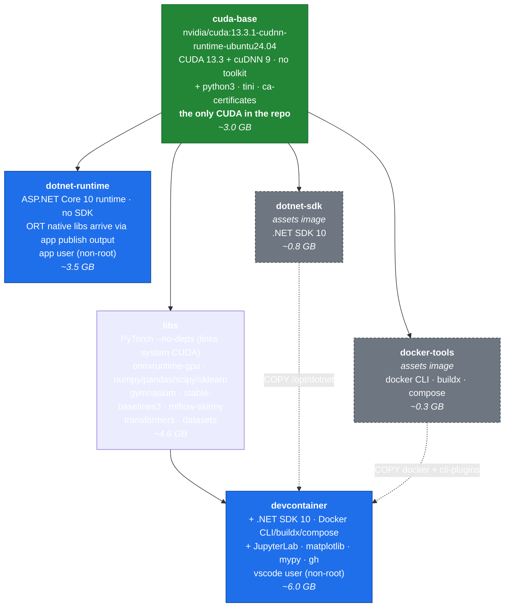

# Design: single-CUDA image stack

**Status:** proposed, awaiting approval. Nothing in this document has been built.

## Intent

Build container images for ML development and for deploying C# services, where:

1. **The devcontainer is the primary deliverable.** It is where applications are
   written *and tested*, so it must contain everything the deployed app needs.
2. **Applications target ONNX Runtime** and are written in C#. They must be
   runnable and testable inside the devcontainer, not only in production.
3. **PyTorch and ONNX Runtime coexist** — PyTorch to train and export models,
   ONNX Runtime to run them. Both need CUDA, in the same image.
4. **Deployment images are lean** — ASP.NET Core runtime, no SDK, no training stack.
5. **CUDA exists exactly once**, both within any single image and across the repo.

## Problem with the current design

The repo currently ships **two complete CUDA stacks** that share no layers:

| image | provisioning | CUDA | cuDNN | payload |
|---|---|---|---|---|
| `devcontainer` | pip wheels in `site-packages/nvidia` | 13.2 | 9.24 | 3.22 GB |
| `dotnet-runtime` | system libs from `nvidia/cuda` | 13.3.1 | 9.24 | 2.88 GB |

6.1 GB of CUDA for two builds of the same thing, differing by a patch version.
They cannot share layers — different roots, different distributions (Debian vs
Ubuntu), different paths. A host running both pulls both.

This was a deliberate split made on the assumption that the deployment image
needed no PyTorch and the devcontainer needed no ONNX Runtime. That assumption
was wrong: requirement 3 above means one image needs both.

Two further problems follow from the same split:

- **`base` is not the base of everything.** It roots only the development
  branch; the deployment branch roots at `cuda-runtime`. The name promises a
  foundation the repo does not have.
- **`ml-libs` and `gpu-ml` are no longer distinct.** `gpu-ml` adds a single
  263 MB layer and has one consumer. The fan-out that justified the split
  disappeared when PyTorch moved into `ml-libs`.

## Proposed stack

One root. One CUDA. Every image shares it.

Solid arrows are `FROM`. Dashed arrows are `COPY --from` — only selected
binaries are lifted out, so the assets images' apt metadata never reaches the
final image. Sizes are estimates, not measurements.

### What this buys

- **One CUDA stack, repo-wide.** `devcontainer` and `dotnet-runtime` share the
  `cuda-base` layer. A host running both pulls ~3.0 GB of CUDA once instead of
  6.1 GB twice.
- **ONNX apps are testable where they are written.** PyTorch and ONNX Runtime
  sit in the same image, both bound to the same system CUDA.
- **`cuda-base` really is the base of everything.** No orphan branch.
- **Six targets instead of eight.** `gpu-ml` merges into `libs`; `cuda-runtime`
  merges into `cuda-base`.
- **No name stutter.** Target `libs` + prefix `goldsam/ml` publishes as
  `ghcr.io/goldsam/ml-libs`.

### What this costs

- **PyTorch installs with `--no-deps`.** Its `nvidia-*` wheels are skipped so it
  links the system CUDA. This is not the configuration PyTorch ships by default.
- **Version pinning becomes load-bearing.** torch 2.14 is built against CUDA
  13.2; the base provides 13.3.1. CUDA minor versions are normally forward
  ABI-compatible, but torch upgrades and base-image upgrades now have to be
  checked together rather than bumped independently.
- **pip must be prevented from re-adding the wheels.** torch declares
  `nvidia-*` as hard dependencies, so `/opt/torch-constraints.txt` has to pin
  them out, and every later `pip install` depends on that holding.
- **Python comes from the distro, not `python:3.x-slim`.** The base is Ubuntu,
  so the Python version is whatever that release ships, or an extra install step.

## Decisions to confirm

| # | Decision | Proposal |
|---|---|---|
| 1 | Ubuntu 24.04 or 26.04 base | **24.04** — better-tested with .NET and CUDA; 26.04 is newer but less proven |
| 2 | Python version | Whatever the base ships, unless a newer one is required. Dropping `python:3.14-slim` is a real loss |
| 3 | `onnxruntime-gpu` Python package | Install **without** its `cuda`/`cudnn` extras so it uses system CUDA |
| 4 | Keep `triton` | **Yes** in `devcontainer` — `torch.compile` and the kernel ecosystem depend on it (~0.9 GB) |
| 5 | Keep `nccl` / `cusparselt` / `nvshmem` | Open — ~0.5 GB, only needed for multi-GPU and structured sparsity |
| 6 | `azure-ml` | Stays disabled |

## Risks

1. **Unverified: `torch --no-deps` against system CUDA 13.3.** This is the
   assumption the whole design rests on. It must be tested before any of this is
   built — install torch with `--no-deps` on the CUDA 13.3 base, confirm
   `libtorch_cuda.so` has no unresolved shared-object dependencies, and confirm
   `torch.cuda.is_available()` on a real GPU.
2. **No GPU on the current build host,** so `torch.cuda.is_available()` cannot be
   verified locally. Static linkage can be checked; actual kernel execution cannot.
3. **ONNX Runtime and PyTorch may want different cuDNN majors.** Both currently
   want cuDNN 9, but this couples two independent upgrade cadences.
4. **Fallback if this fails:** keep the current two-root design and accept two
   CUDA stacks, documenting that they are separate deliberately.

## Out of scope

- Publishing to the registry
- Any change to `azure-ml`
- Multi-architecture builds (`linux/arm64`)
