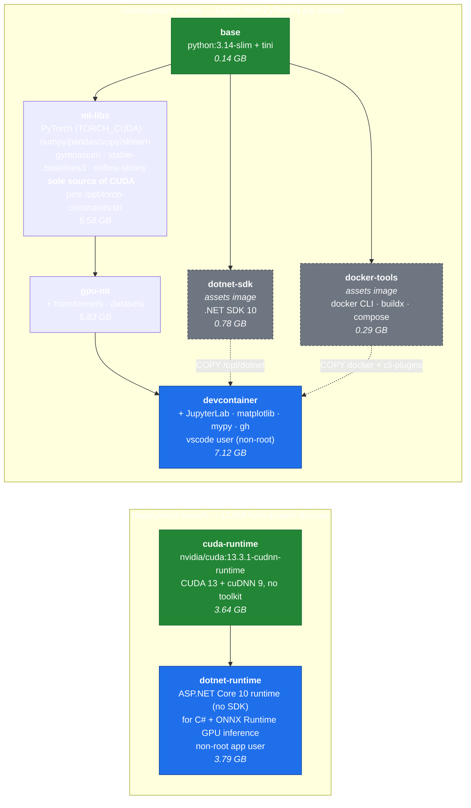

# ml-images

Container images for ML development and deployment, built with [Buildx Bake](https://docs.docker.com/build/bake/).

Published to `ghcr.io/goldsam/ml-<target>`.

## Images

Two independent branches. They are kept separate on purpose: each provisions CUDA
a different way, so no single image ever contains two CUDA stacks.

Solid arrows are `FROM` (the image is built on top). Dashed arrows are
`COPY --from` (only selected binaries are lifted out, so the source image's apt
metadata and download tooling never reach the final image).



Green = branch roots · blue = published deliverables · grey dashed = assets
images, built only to be copied out of. Sizes are unpacked on-disk; see
[Notes on size and build time](#notes-on-size-and-build-time) for pull sizes.

`dotnet-sdk` and `docker-tools` have no dependency on `ml-libs`, so bake builds
all three concurrently and `devcontainer` joins them at the end.

**Why two roots.** The devcontainer needs PyTorch, whose wheels bundle their own
`nvidia-*` CUDA libraries. The deployment image needs CUDA for ONNX Runtime's
native provider, which wants system libraries — and no PyTorch at all. Sharing
one root would force one of them to carry a CUDA stack it cannot use.

The deployment CUDA major is set by ONNX Runtime, not PyTorch:
`Microsoft.ML.OnnxRuntime.Gpu` 1.30 targets CUDA 13 (`nvidia-cuda-runtime~=13.0`,
`nvidia-cudnn-cu13~=9.0`). The NuGet package ships ORT's own native libraries in
your publish output but *not* CUDA or cuDNN, which is what this image supplies.
Nothing ONNX-specific is installed here — bump `CUDA_RUNTIME_IMAGE` if ORT
changes its CUDA major.

## Usage

Consume the devcontainer from another project's `.devcontainer/devcontainer.json`:

```json
{
  "name": "ML Development",
  "image": "ghcr.io/goldsam/ml-devcontainer:latest",
  "remoteUser": "vscode",
  "workspaceFolder": "/workspace",
  "runArgs": ["--gpus=all"],
  "mounts": ["type=bind,source=/var/run/docker.sock,target=/var/run/docker.sock"]
}
```

Deploy a C# service:

```dockerfile
FROM ghcr.io/goldsam/ml-dotnet-runtime:latest
COPY --chown=app:app ./publish /opt/app
CMD ["dotnet", "/opt/app/MyService.dll"]
```

## Building

```bash
make build                 # devcontainer + its dependencies
make build all             # every image
make build runtime         # deployment branch only
make build ml-libs         # a single target
make build TORCH_CUDA=cpu  # lean CPU-only ML stack
make print                 # resolved bake config
make test                  # smoke-test a locally built devcontainer
```

Bake builds the independent targets concurrently and shares the `base` layers
between them, so `make build all` is substantially cheaper than building each
image on its own.

### Variables

| Variable | Default | Purpose |
|---|---|---|
| `REGISTRY` | `ghcr.io/` | Registry prefix |
| `IMAGE_PREFIX` | `goldsam/ml` | Image name prefix |
| `VERSION` | `latest` | Tag |
| `TORCH_CUDA` | `cu132` | PyTorch build: any directory under `download.pytorch.org/whl/`, or `cpu`. `cu134` exists but ships no cp313/cp314 wheels |
| `TORCH_VERSION` | *(empty)* | Pin a specific torch version; empty means latest for that CUDA build |
| `DOTNET_CHANNEL` | `10.0` | .NET channel (10.0 is the current LTS) for both the SDK and runtime images |
| `CUDA_RUNTIME_IMAGE` | `nvidia/cuda:13.3.1-cudnn-runtime-ubuntu26.04` | Deployment-branch CUDA base |
| `CACHE_TYPE` | `local` | `local` or `registry` (CI uses `registry`) |
| `PLATFORMS` | `linux/amd64` | Comma-separated build platforms |

## Notes on size and build time

**One CUDA stack per image.** `stable-baselines3` depends on `torch`, so
installing it without a pre-satisfied torch pulls the default PyPI build and its
full set of `nvidia-*` wheels (~3.1 GB). If a later layer then installs torch
from a CUDA index, that is a *second* ~2.9 GB stack — and because layers are
additive, both ship. `ml-libs` therefore installs torch from the chosen index
**first**, then freezes the CUDA packages into `/opt/torch-constraints.txt` and
sets `PIP_CONSTRAINT`. Everything downstream, including `pip install` run by a
user inside the devcontainer, is pinned to that one stack. `smoke-test.sh`
asserts this and fails if a duplicate reappears.

**Layer ordering for fast iteration.** In `ml-libs`, torch is installed from
build args alone with no `COPY`, so editing `requirements.txt` does not
invalidate the multi-GB torch layer. Development-only packages live in the last
layer of `devcontainer`, so changing them rebuilds ~200 MB rather than ~4 GB.

**Cache mounts are local-only.** `--mount=type=cache` state is not exported by
any cache backend, and CI gets a fresh builder per run, so those mounts are cold
in GitHub Actions. They speed up local rebuilds; the registry layer cache
(`CACHE_TYPE=registry`) is what saves time in CI.

**Sizes are uncompressed.** `docker images` reports on-disk size; the registry
transfers compressed layers. `ml-cuda-runtime` shows ~7.3 GB locally but pulls
~2.3 GB. For the deployment branch, cuDNN accounts for only ~0.56 GB of that —
the CUDA runtime libraries are the bulk — so dropping to a non-cuDNN base saves
little and breaks ONNX Runtime's convolution kernels.

**Each target has its own build context** (`images/<target>/`), containing only a
Dockerfile and a requirements file. Contexts are tiny, unrelated edits don't
invalidate each other, and no `.dockerignore` is needed.

## Disabled

`images/azure-ml/` is present but its bake target is commented out in
`docker-bake.hcl`. Uncomment the target and add `azure-ml` to `group "all"` to
re-enable.
